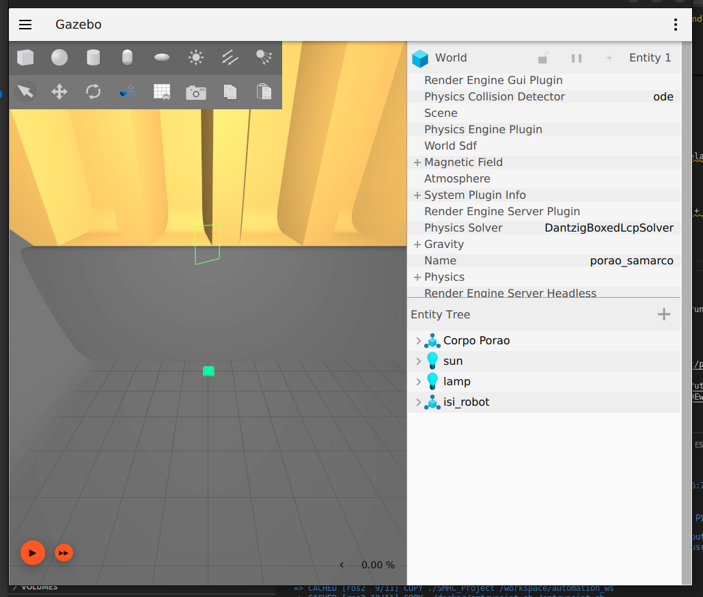
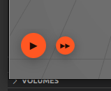

# Samarco

## Versões dos componentes

- Ubuntu 22.04.5 LTS (Jammy Jellyfish)
- ROS Humble
- Gazebo Fortress (Gazebo Sim 6.17.0)
- Docker Engine

### Pre-requisitos

Para Linux
- Docker

Para Windows
- Docker
- VcXsrv (Servidor X11 para Windows)

## Como executar o projeto

### Computadores Linux

1. Copie a pasta do projeto para o seu computador

2. Executar o comando necessario para liberar conexão ao gerenciador de janelas X11 no seu computador
```
xhost +local:root
```

3. Dentro da pasta do projeto execute o comando para rodar o container ROS2 + Gazebo
```
sudo docker compose -f docker-compose.yaml up --build -d
```
aguarde alguns segundos e deve aparecer uma notificação, como imagem abaixo: <br>


e mais alguns segundos deve surgir a tela do Gazebo Fortress:<br>


no canto inferior esquerdo aperte o botão "PLAY" para iniciar a simulação:<br>


a deve ser exibido um contador de frames, conforma abaixo:<br>


4. Inicie o teleoperacional para controlar o rodo com o comando abaixo no terminal:
```
sudo docker container exec -it samarco-ros2-1 /workspace/automation_ws/src/run.sh
```


### Computadores Windows

1. Copie a pasta do projeto para o seu computador
2. Baixe e instale o servidor de janelas X11 para Windows <https://sourceforge.net/projects/vcxsrv/files/latest/download>
3. Baixe e instale o Docker Desktop 
<https://desktop.docker.com/win/main/amd64/Docker%20Desktop%20Installer.exe?utm_source=docker&utm_medium=webreferral&utm_campaign=dd-smartbutton&utm_location=module&_gl=1*eajb5i*_gcl_au*MTI3NDAwNTYyOC4xNzQyODMwNDkz*_ga*MTA2Mjc4NDM5NS4xNzQyNDEwNDUx*_ga_XJWPQMJYHQ*MTc0MjgzMDQ5My4xMS4xLjE3NDI4MzA1NzQuNDYuMC4w>

4.